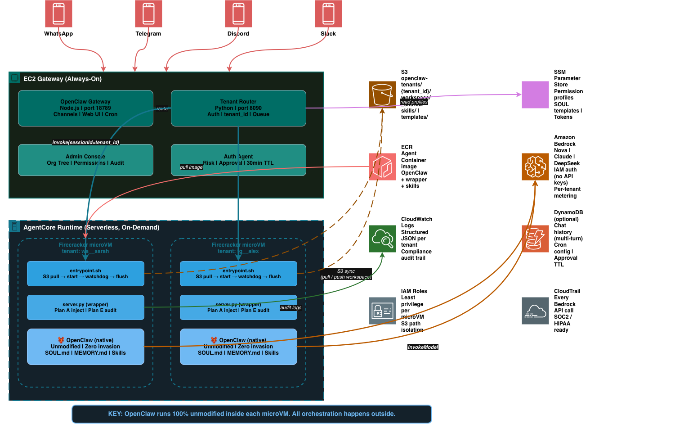

# OpenClaw 企业多租户平台 — 进度记录

日期: 2026-03-10

---

## 整体架构

### 一句话

EC2 上常驻一只龙虾 (OpenClaw Gateway) 作为统一入口，管理组织架构、渠道连接和 Cron 调度；员工的每次请求经 Gateway 鉴权后，弹性拉起 Serverless 的 Firecracker microVM (Bedrock AgentCore Runtime)，在隔离环境中运行原生 OpenClaw，执行完毕自动释放。OpenClaw 代码零修改。

### 架构图



### 核心流程

```
员工 (WhatsApp/Telegram/Discord/Slack)
  │
  ▼
EC2 Gateway (常驻)
  ├── OpenClaw Gateway (Node.js, port 18789) — 渠道长连接、Web UI、Cron
  └── Tenant Router (Python, port 8090) — 鉴权、派生 tenant_id、请求排队
        │
        │  invoke(runtimeSessionId=tenant_id, payload=message)
        ▼
AgentCore Runtime (Serverless)
  └── Firecracker microVM (每租户隔离)
        │
        │  entrypoint.sh 启动:
        │  1. 先启动 server.py (立即响应 /ping health check)
        │  2. 从 S3 拉取租户 workspace (SOUL.md, MEMORY.md, Skills)
        │  3. 启动 OpenClaw gateway (后台，等待就绪)
        │  4. watchdog 每 60s sync workspace 回 S3
        │
        │  请求到达 /invocations:
        │  5. server.py 构建 Plan A system prompt (权限约束)
        │  6. 转发给 OpenClaw /v1/chat/completions
        │  7. OpenClaw 调 Bedrock 推理
        │  8. server.py 做 Plan E 审计 (扫描响应中的违规工具调用)
        │  9. 返回响应
        │
        │  关停:
        │  10. SIGTERM → 杀 OpenClaw → flush workspace 到 S3 → 释放
        ▼
响应原路返回 → Gateway → 员工收到回复
```

### 零入侵设计

OpenClaw 在 microVM 里原生运行，不知道自己在企业平台上。所有管控通过外层实现:

| 管控层 | 怎么做 | 用的 OpenClaw 接口 |
|---|---|---|
| entrypoint.sh | S3 拉取/写回 workspace | OpenClaw 只看到本地文件系统 |
| server.py | Plan A 权限注入 + Plan E 审计 | /v1/chat/completions (标准 API) |
| openclaw.json | 配置 Bedrock 模型 | ~/.openclaw/openclaw.json (标准配置) |
| SOUL.md | 人格/规则/行为边界 | OpenClaw 原生读取 workspace/SOUL.md |
| ECR 镜像 | 版本管理 | npm install -g openclaw@latest |

升级 OpenClaw: rebuild 镜像 push ECR，所有租户下次请求自动用新版本。

### AWS 服务选型

| 数据类型 | AWS 服务 | 理由 |
|---|---|---|
| 灵魂/权限配置 | SSM Parameter Store | 免费、加密、热更新 |
| 租户 workspace | S3 | 便宜、版本控制、增量 sync |
| 容器镜像 | ECR | 版本管理、ARM64 支持 |
| 模型推理 | Amazon Bedrock | IAM 认证、10+ 模型、无 API Key |
| 审计日志 | CloudWatch Logs | 结构化 JSON、按 tenant_id 过滤 |
| API 审计 | CloudTrail | 每次 Bedrock 调用自动记录 |
| 对话历史 (规划) | DynamoDB | 多轮上下文、TTL 自动过期 |
| 资源隔离 | IAM | 每 microVM 最小权限、S3 路径隔离 |

---

## 核心代码文件

### agent-container/entrypoint.sh — microVM 入口

容器启动时的第一个脚本。管理完整生命周期:

```
Phase 1.5: 立即启动 server.py → 响应 /ping health check (AgentCore 要求秒级响应)
Phase 1:   从 S3 拉取租户 workspace (SOUL.md, MEMORY.md, memory/*.md, skills)
           如果新租户 → 从 SSM 读角色模板 → 从 S3 拉模板初始化 SOUL.md
           拉取 SQLite 向量索引 (避免每次重建)
Phase 2:   启动 watchdog 后台线程，每 60s aws s3 sync 写回
Phase 3:   trap SIGTERM → 杀 watchdog → 杀 server.py → 最终 sync → exit
```

### agent-container/server.py — HTTP wrapper (Plan A + Plan E)

AgentCore 调用的 HTTP 端点。两个关键路径:

- `GET /ping` → 返回 `{"status":"Healthy"}` 或 `{"status":"HealthyBusy"}`，AgentCore 用这个判断容器是否存活
- `POST /invocations` → 收到请求后:
  1. 从 payload 提取 tenant_id
  2. 从 SSM 读权限 profile → 构建 Plan A system prompt ("Allowed: web_search. Blocked: shell, code_execution...")
  3. 转发给 OpenClaw 的 /v1/chat/completions
  4. Plan E: 扫描响应文本，检测是否使用了被禁止的工具
  5. 记录审计日志到 CloudWatch

OpenClaw 在后台线程启动 (`start_openclaw_background`)，HTTP 服务器先启动确保 health check 通过。

### agent-container/openclaw.json — OpenClaw 配置模板

Bedrock provider 配置，使用 `${AWS_REGION}` 和 `${BEDROCK_MODEL_ID}` 环境变量替换。server.py 启动时写入 `~/.openclaw/openclaw.json`。

### agent-container/Dockerfile — 容器镜像

```
Python 3.12-slim
  + AWS CLI v2 (架构感知: aarch64/x86_64)
  + Node.js 22 + git
  + OpenClaw (npm install -g openclaw@latest)
  + Python 依赖 (boto3, requests)
  + entrypoint.sh + server.py + openclaw.json + permissions.py + safety.py
  + OpenClaw templates symlink
ENTRYPOINT: /app/entrypoint.sh
```

### src/gateway/tenant_router.py — Gateway 到 AgentCore 的路由

EC2 上运行的 Python HTTP 服务 (port 8090):

- `derive_tenant_id(channel, user_id)` → 生成 33+ 字符的 tenant_id (AgentCore 要求)
- `invoke_agent_runtime(tenant_id, message)` → 调用 `bedrock-agentcore` SDK 的 `invoke_agent_runtime`
- 自动从 STS 获取 account_id 构造 Runtime ARN
- 支持 demo 模式 (直连本地 Agent Container) 和生产模式 (调 AgentCore API)

### clawdbot-bedrock-agentcore-multitenancy.yaml — CloudFormation

一个 YAML 部署全部基础设施:
- VPC + Subnet + Security Group
- EC2 (Graviton ARM) + IAM Role (Bedrock + SSM + ECR + S3 + AgentCore)
- ECR Repository
- S3 Bucket (openclaw-tenants-{AccountId})，版本控制开启
- SSM Parameters (gateway token, 默认权限 profile)
- CloudWatch Log Group

### deploy-multitenancy.sh — 一键部署

5 步: CloudFormation → S3 模板上传 → Docker build+push → AgentCore Runtime 创建 → SSM 存储 Runtime ID

### agent-container/build-on-ec2.sh — 远程构建

当本地 Docker 不可用时 (公司安全基线)，上传代码到 S3，在 EC2 上 build + push ECR。

---

## 已完成

### 1. 设计定稿

- 架构设计: EC2 Gateway (常驻龙虾) + AgentCore Runtime (按需 microVM) + S3 workspace sync
- 零入侵原则: OpenClaw 代码一行不改，所有管控在外层完成
- 文件持久化: SOUL.md/MEMORY.md/Skills 存 S3，每次 microVM 启动拉取、运行中 watchdog sync、关停时 flush
- 权限执法: Plan A (system prompt 注入) + Plan E (响应审计) + IAM (AWS 资源隔离)
- 审批流: Auth Agent 独立会话，30 分钟超时自动拒绝
- Cron: Gateway 龙虾集中调度，到点拉起 microVM 执行

### 2. 基础设施部署 (us-east-1)

| 资源 | 状态 | 标识 |
|---|---|---|
| CloudFormation stack | CREATE_COMPLETE | openclaw-multitenancy |
| EC2 Gateway | 运行中 | i-0aa07bd9a04fa2255 |
| ECR 镜像仓库 | 已创建 | openclaw-multitenancy-multitenancy-agent |
| S3 租户桶 | 已创建 | openclaw-tenants-263168716248 |
| AgentCore Runtime | READY | openclaw_multitenancy_runtime-olT3WX54rJ |
| SOUL.md 模板 | 已上传 | _shared/templates/{default,intern,engineer}.md |
| Docker 镜像 | 已 push | 含 AWS CLI + Node.js 22 + OpenClaw + entrypoint.sh |
| Tenant Router | 运行中 | EC2 port 8090 |
| OpenClaw Gateway | 运行中 | EC2 port 18789 |

### 3. 链路验证

| 链路 | 状态 | 备注 |
|---|---|---|
| IM → EC2 Gateway → Bedrock → 回复 | ✅ 跑通 | 单用户模式，生产可用 |
| Tenant Router → AgentCore invoke | ✅ 跑通 | tenant_id 正确派生 (33+ 字符) |
| AgentCore → Firecracker microVM 启动 | ✅ 跑通 | 容器成功拉起 |
| entrypoint.sh → S3 pull workspace | ✅ 跑通 | SOUL.md 从模板初始化 |
| server.py → /ping health check | ✅ 跑通 | 返回 {"status":"Healthy"} |
| server.py → /invocations 响应 | ✅ 跑通 | 返回了响应 (空，因 OpenClaw 未就绪) |
| OpenClaw 容器内完整启动 | ❌ 未完成 | 冷启动超时，见卡点 #1 |
| IM → Tenant Router → AgentCore → 回复 | ❌ 未完成 | 需要 webhook bridge |

### 4. 文档和 Demo

| 产出 | 位置 |
|---|---|
| 两页纸方案文档 | OpenClaw-企业多租户方案一页纸.md |
| 三项目对比 | AgentCore-OpenClaw-对比.md |
| 架构图 (Draw.io) | images/architecture-multitenant.drawio.png |
| 时序图 (Mermaid) | images/sequence-diagrams.md (5 张) |
| Admin Console (CloudFront) | https://d2mv4530orbo0c.cloudfront.net |
| Admin Console (本地) | python3 demo/console.py → localhost:8099 |
| 部署脚本 | deploy-multitenancy.sh |
| 静态站构建 | demo/build_static.py |
| 静态站 CFN | demo/deploy-static-site.yaml |

---

## 核心卡点

### 卡点 1: OpenClaw 容器内冷启动超时

**现象**: entrypoint.sh 和 server.py 都能启动，health check 通过，但 OpenClaw (`openclaw gateway`) 启动需要 30-60 秒。在这期间 `/invocations` 请求到达时 OpenClaw 还没 ready，返回空响应。

**根因**: OpenClaw 是一个 Node.js 应用，全局 npm 安装后首次启动需要加载模块、初始化配置、建立内部状态。在 Firecracker microVM 的资源受限环境下更慢。

**解法方案** (按优先级):
1. server.py 缓存首次请求，OpenClaw ready 后重放 — 改动最小
2. 预热机制: entrypoint.sh 在 S3 sync 后主动发一个 probe 请求触发 OpenClaw 启动，等 ready 后再接受外部请求
3. 镜像优化: 把 OpenClaw 的 node_modules 预编译到镜像里，减少启动时的模块解析时间

### 卡点 2: tenant_id 传递

**现象**: entrypoint.sh 里 `SESSION_ID` 环境变量是 "unknown"，因为 AgentCore 不通过环境变量传 sessionId，而是通过 `/invocations` HTTP payload 传。

**根因**: entrypoint.sh 在 server.py 之前启动，此时还没收到任何请求，不知道 tenant_id。

**解法方案**:
1. entrypoint.sh 用默认 workspace 启动，server.py 在收到第一个请求时从 payload 提取 tenant_id，动态做 S3 sync — 最务实
2. 用 AgentCore 的 `runtimeSessionId` 作为容器的环境变量 (需要确认 AgentCore 是否支持)

### 卡点 3: IM → 多租户链路桥接

**现象**: 目前 IM 消息直接到 EC2 Gateway 的 OpenClaw，没有经过 Tenant Router。

**根因**: OpenClaw Gateway 是消息的入口，它直接处理消息而不是转发给 Tenant Router。

**解法方案**:
1. OpenClaw webhook: 配置 OpenClaw 的 HTTP webhook 把消息转发到 localhost:8090/route
2. 写一个 bridge 脚本: 监听 OpenClaw 的 WebSocket 事件，转发到 Tenant Router，再把响应发回
3. 替换 OpenClaw 的 agent 后端: 让 OpenClaw Gateway 的 model provider 指向 Tenant Router 而不是直接调 Bedrock

---

## 踩过的坑 (经验)

### AWS CLI 版本
- `bedrock-agentcore-control` 需要 AWS CLI >= 2.27
- EC2 上的 boto3 也需要升级 (`pip3 install --upgrade boto3`)
- 服务名是 `bedrock-agentcore` 不是 `bedrock-agentcore-runtime`

### AgentCore API 参数
- `--agent-runtime-name` 只允许 `[a-zA-Z][a-zA-Z0-9_]{0,47}`，不能有连字符
- `runtimeSessionId` 最少 33 字符，短 tenant_id 需要 hash 补长
- `--environment-variables` shorthand 格式是 `Key=Value,Key=Value`
- `agentRuntimeArn` 需要完整 ARN，不是 runtime ID
- Runtime 和 Endpoint 是分开创建的 (create-agent-runtime + create-agent-runtime-endpoint)

### OpenClaw 配置
- 配置文件路径: `~/.openclaw/openclaw.json`，不支持 `--config` CLI 参数
- 配置 schema 变化频繁，`auth.type`/`sessions`/`model` 等旧 key 不再支持
- 需要 `docs/reference/templates/` 目录，否则启动报错 Missing workspace template
- 启动命令是 `openclaw gateway --port 18789`，不是 `openclaw --config xxx`

### Docker 构建
- 本地 Docker Desktop 可能因公司安全基线无法使用 — 在 EC2 上 build 是替代方案
- OpenClaw npm install 需要 `git` (某些依赖从 git clone)
- AWS CLI 安装需要区分 aarch64/x86_64 架构
- `hypothesis` 不应该在生产 requirements.txt 里

### AgentCore 容器要求
- 必须监听 0.0.0.0:8080
- 必须是 ARM64 镜像
- `/ping` 必须返回 `{"status":"Healthy"}` 或 `{"status":"HealthyBusy"}`
- health check 在容器启动后几秒内就会到达，HTTP 服务器必须最先启动
- 容器如果 health check 失败会被反复重启

### CloudFormation
- `AWS::EC2::KeyPair::KeyName` 类型会验证 key pair 必须存在，空值会失败 — 改用 String + Condition
- `ecr:GetAuthorizationToken` 的 Resource 必须是 `*`，不能限制到具体 repo ARN
- EC2 Role 需要 ECR push 权限 (PutImage/InitiateLayerUpload 等) 才能在 EC2 上 build

### S3 日志
- S3 访问日志不能投递到自身桶 — 会导致日志静默停止
- Athena 查不到新数据时先检查分区，再检查日志投递配置

---

## 下一步 (优先级排序)

1. **解决 OpenClaw 冷启动** — server.py 缓存首次请求 + 预热机制
2. **tenant_id 动态传递** — server.py 从 /invocations payload 提取，触发 S3 sync
3. **IM 桥接** — 让 IM 消息走 Tenant Router 而不是直连 Gateway
4. **端到端验证** — 从 Telegram 发消息 → 经过多租户链路 → 收到 Bedrock 响应
5. **S3 workspace 写回验证** — 确认 MEMORY.md 更新后能 sync 回 S3
6. **第二个租户测试** — 验证两个不同 tenant_id 的隔离性

---

## 关键文件清单

| 文件 | 用途 |
|---|---|
| agent-container/entrypoint.sh | microVM 入口: S3 sync + OpenClaw 生命周期 |
| agent-container/server.py | HTTP wrapper: health check + Plan A/E + OpenClaw 代理 |
| agent-container/openclaw.json | OpenClaw 配置模板 (Bedrock provider) |
| agent-container/Dockerfile | 容器镜像: Python 3.12 + AWS CLI + Node.js 22 + OpenClaw |
| agent-container/build-on-ec2.sh | EC2 上远程 build Docker 镜像的脚本 |
| agent-container/templates/*.md | SOUL.md 角色模板 (default/intern/engineer) |
| src/gateway/tenant_router.py | Gateway → AgentCore 路由 (tenant_id 派生 + invoke) |
| clawdbot-bedrock-agentcore-multitenancy.yaml | CloudFormation: EC2 + ECR + S3 + SSM + IAM |
| deploy-multitenancy.sh | 一键部署脚本 |
