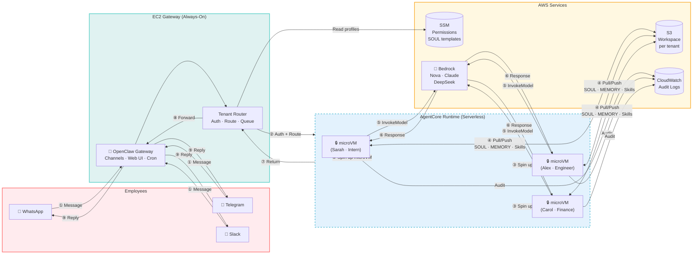
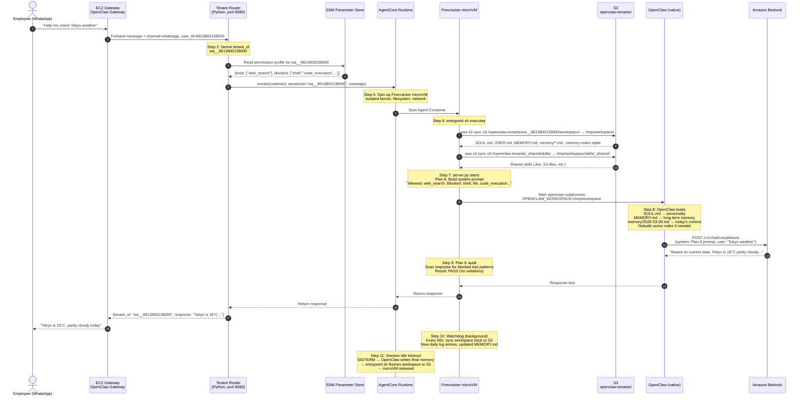
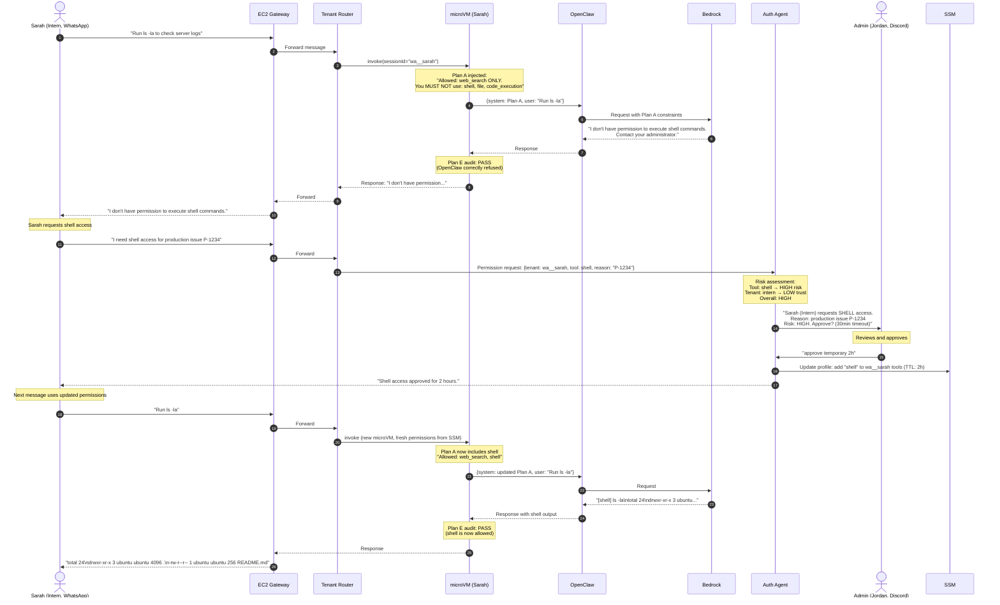
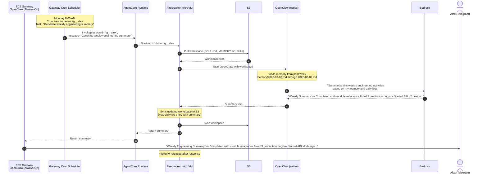
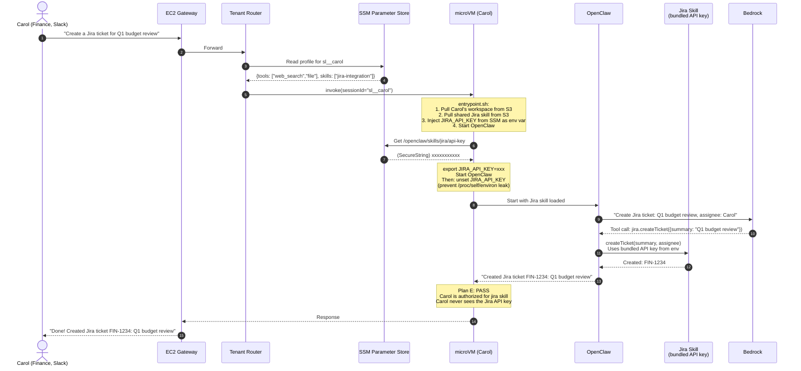

# OpenClaw Enterprise Multi-Tenant — Sequence Diagrams

## Overview: How It Works (Simplified)

**9 steps, one sentence each:**

| Step | What happens |
|------|-------------|
| ① | Employee sends message via WhatsApp/Telegram/Slack |
| ② | Gateway authenticates, derives `tenant_id`, checks permissions in SSM |
| ③ | AgentCore spins up an isolated Firecracker microVM for this tenant |
| ④ | entrypoint.sh pulls tenant's workspace from S3 (SOUL.md, MEMORY.md, Skills) |
| ⑤ | OpenClaw runs natively inside microVM, calls Bedrock for inference |
| ⑥ | Bedrock returns response, Plan E audits for policy violations |
| ⑦ | microVM returns response to Gateway, syncs workspace back to S3 |
| ⑧ | Gateway forwards response through the original channel |
| ⑨ | Employee receives reply. microVM released after idle timeout. |

> **Key insight:** OpenClaw runs 100% unmodified. All orchestration (auth, routing, S3 sync, audit) happens outside.

---

## Flow 1: Employee Sends a Message (Detailed)

## Flow 2: Permission Denied → Approval Flow

## Flow 3: Scheduled Task (Cron)

## Flow 4: Shared Skill with Bundled Credentials

